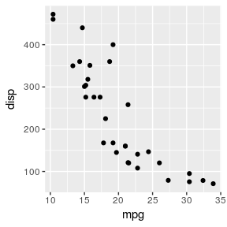
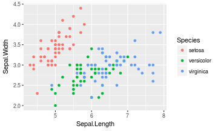
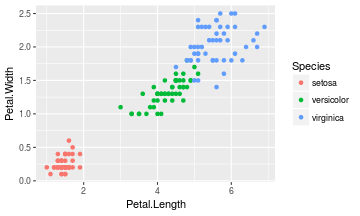

<!-- README.md is generated from README.Rmd. Please edit that file -->
ggpipe
======

*ggplot with the pipe*

This package wraps most `ggplot2` functions so they work with the pipe `%>%` with [minimal overhead](http://rpubs.com/zeehio/ggpipe-overhead) (if noticeable).

[](https://travis-ci.org/zeehio/ggpipe) [](https://cran.r-project.org/package=ggpipe)

Installation
------------

You can install ggpipe from github with:

``` r
# install.packages("devtools")
devtools::install_github("zeehio/ggpipe")
```

Example
-------

``` r
# as ggpipe wraps ggplot2 functions, do not use library(ggplot2) in your scripts
library(ggpipe)
ggplot(mtcars) %>% 
  geom_point(aes(x = mpg, y = disp)) 
```



This package provides an additional `unggplot()` function to get back the data from the plot, so multiple plots could be generated on a single pipe:

``` r

iris_sepal_png <- "README-iris_sepal.png"
iris_petal_png <- "README-iris_petal.png"

iris %>%
  ggplot() %>%
  geom_point(aes(x = Sepal.Length, y = Sepal.Width, color = Species)) %>%
  ggsave(iris_sepal_png, height = 3, width = 5, dpi = 72) %>%
  unggplot() %>%
  ggplot() %>%
  geom_point(aes(x = Petal.Length, y = Petal.Width, color = Species)) %>%
  ggsave(iris_petal_png, height = 3, width = 5, dpi = 72) %>%
  unggplot() %>%
  head()
#>   Sepal.Length Sepal.Width Petal.Length Petal.Width Species
#> 1          5.1         3.5          1.4         0.2  setosa
#> 2          4.9         3.0          1.4         0.2  setosa
#> 3          4.7         3.2          1.3         0.2  setosa
#> 4          4.6         3.1          1.5         0.2  setosa
#> 5          5.0         3.6          1.4         0.2  setosa
#> 6          5.4         3.9          1.7         0.4  setosa
```

Plot the two figures:

``` r
knitr::include_graphics(iris_sepal_png)
```



``` r
knitr::include_graphics(iris_petal_png)
```


